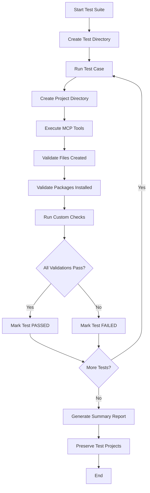

# MCP Tool Testing Strategy

## Overview

This document outlines the comprehensive testing strategy for the Next.js MCP tools. Instead of traditional unit tests, we use **real project creation testing** - actually running the MCP tools to create Next.js projects and validating the results.

## Why Real Project Testing?

Traditional unit tests can't capture the complexity of:
- ✅ **File System Operations**: Creating directories, writing files, handling permissions
- ✅ **Package Management**: Installing dependencies, resolving versions, handling conflicts  
- ✅ **Tool Integration**: How different tools work together in sequence
- ✅ **Project Structure**: Ensuring generated projects follow Next.js conventions
- ✅ **Build Validation**: Verifying that generated projects actually compile and run

## Testing Architecture

```
🧪 Test Runner
├── 📁 Project Creation (real Next.js projects)
├── 🔧 Tool Execution (actual MCP tool calls)
├── ✅ File Validation (expected files created)
├── 📦 Package Validation (dependencies installed)
├── 🏗️ Build Testing (TypeScript compilation)
└── 📊 Comprehensive Reporting
```

## Test Categories

### 1. **Individual Tool Tests**
Each tool is tested in isolation to ensure it works independently:

- **create_nextjs_base**: Core Next.js project creation
- **setup_biome_linting**: Linting configuration
- **setup_vscode_config**: Editor configuration  
- **setup_drizzle_orm**: Database ORM setup
- **setup_environment_vars**: Environment configuration
- **setup_authentication_jwt**: Authentication system
- **setup_protected_routes**: Route protection middleware
- **setup_stripe_payments**: Payment processing
- **setup_stripe_webhooks**: Webhook handling
- **setup_team_management**: Multi-tenant teams
- **setup_form_handling**: Form management system

### 2. **Integration Tests**
Test combinations of tools to ensure they work together:

- **Core Stack**: Next.js + Biome + VSCode
- **Database Stack**: Drizzle + Environment Variables  
- **Auth Stack**: JWT Authentication + Protected Routes
- **Payment Stack**: Stripe Payments + Webhooks
- **Complete SaaS**: All tools combined

### 3. **Validation Tests**
Comprehensive validation of generated projects:

- **File Structure**: All expected files and directories created
- **Package Dependencies**: Required npm packages installed
- **TypeScript Compilation**: Generated code compiles without errors
- **Configuration Files**: Valid config files (Next.js, Tailwind, Drizzle, etc.)
- **Component Integration**: UI components render correctly

## Test Execution Flow



## Test Cases

### Basic Next.js Setup
```typescript
{
  name: "Basic Next.js Setup",
  tools: [{ name: "create_nextjs_base", config: {} }],
  expectedFiles: ["package.json", "next.config.js", "app/layout.tsx"],
  expectedPackages: ["next", "tailwindcss"],
  validationChecks: [
    { type: 'file-exists', check: 'components.json' },
    { type: 'package-installed', check: 'next' }
  ]
}
```

### Complete SaaS Application  
```typescript
{
  name: "Complete SaaS Application",
  tools: [
    { name: "create_nextjs_base", config: {} },
    { name: "setup_drizzle_orm", config: {} },
    { name: "setup_authentication_jwt", config: {} },
    { name: "setup_stripe_payments", config: {} },
    { name: "setup_team_management", config: {} },
    // ... all other tools
  ],
  expectedFiles: [
    "lib/auth/session.ts",
    "models/team.ts", 
    "lib/payments/stripe-client.ts",
    // ... all expected files
  ],
  validationChecks: [
    { 
      type: 'custom',
      check: async (projectPath) => {
        // Complex validation logic
        return validateCompleteProject(projectPath);
      }
    }
  ]
}
```

## Running Tests

### Command Line Interface

```bash
# Run all tests
pnpm test

# Show detailed help
pnpm test:help

# Clean up test projects  
pnpm test:cleanup
```

### Programmatic Usage

```typescript
import { MCPTestRunner } from './src/testing/test-runner.js';

const runner = new MCPTestRunner();
const results = await runner.runAllTests();

results.forEach(result => {
  if (result.success) {
    console.log(`✅ ${result.testName} passed`);
  } else {
    console.log(`❌ ${result.testName} failed:`);
    result.errors.forEach(error => console.log(`  - ${error}`));
  }
});
```

## Test Output

### Success Output
```
🧪 Starting MCP Tool Testing Suite
📁 Test directory: /path/to/next_test_projects

🔬 Running test: Basic Next.js Setup
✅ Basic Next.js Setup - PASSED (12.34s)

🔬 Running test: Core Tools Setup
✅ Core Tools Setup - PASSED (8.76s)

📊 MCP TOOL TESTING SUMMARY
============================================================
📋 Total Tests: 8
✅ Passed: 8  
❌ Failed: 0
⏱️  Total Duration: 67.89s

🎉 All tests passed! MCP tools are working correctly.
```

### Failure Output
```
🔬 Running test: Authentication System
❌ Authentication System - FAILED (15.67s)
   ❌ Tool setup_authentication_jwt failed: Database required
   ❌ Expected file not found: lib/auth/session.ts
   ❌ Expected package not installed: jose
```

## Test Project Structure

Generated test projects are preserved for manual inspection:

```
next_test_projects/
├── basic-next-js-setup/
│   ├── package.json
│   ├── next.config.js
│   ├── app/
│   └── components/
├── authentication-system/  
│   ├── lib/auth/
│   ├── components/auth/
│   └── middleware.ts
├── complete-saas-application/
│   ├── [all generated files]
│   └── [complete project structure]
└── [other test projects...]
```

## Manual Verification

After tests run, you can manually verify projects:

```bash
# Navigate to a test project
cd next_test_projects/complete-saas-application

# Install dependencies
pnpm install

# Build the project
pnpm build

# Start development server
pnpm dev

# Run linting
pnpm lint  # or pnpm biome check .
```

## CI/CD Integration

### GitHub Actions
```yaml
name: MCP Tool Tests

on: [push, pull_request]

jobs:
  test:
    runs-on: ubuntu-latest
    
    steps:
    - uses: actions/checkout@v4
    
    - name: Setup Node.js
      uses: actions/setup-node@v4
      with:
        node-version: '20'
        
    - name: Setup pnpm
      uses: pnpm/action-setup@v2
      with:
        version: 8
        
    - name: Install dependencies
      run: pnpm install
      
    - name: Build MCP tools
      run: pnpm build
      
    - name: Run MCP tests
      run: pnpm test
      
    - name: Cleanup test projects
      if: always()
      run: pnpm test:cleanup
```

## Performance Considerations

### Test Duration
- **Individual Tools**: 5-15 seconds each
- **Integration Tests**: 15-30 seconds each  
- **Complete SaaS**: 45-60 seconds
- **Full Suite**: 60-90 seconds total

### Resource Usage
- **Disk Space**: ~50-100MB per test project
- **Memory**: Node.js + package manager overhead
- **Network**: Downloads dependencies for each project

### Optimization Strategies
- **Parallel Execution**: Tests run sequentially to avoid conflicts
- **Selective Testing**: Run specific test cases during development
- **Cleanup**: Automated cleanup of old test projects

## Debugging Test Failures

### Common Issues

**Tool Execution Failures**
```
❌ Tool setup_authentication_jwt failed: Database is required
```
- Check tool dependencies and prerequisites
- Verify tools are executed in correct order
- Review tool configuration parameters

**Missing Files**
```  
❌ Expected file not found: lib/auth/session.ts
```
- Check tool implementation for file creation
- Verify file paths and naming conventions
- Look for typos in expected file paths

**Missing Packages**
```
❌ Expected package not installed: jose  
```
- Check tool's package installation logic
- Verify package names and versions
- Look for installation command failures

### Debug Mode

Enable detailed logging by setting environment variables:

```bash
DEBUG=mcp:* pnpm test
```

### Manual Project Inspection

```bash
# Navigate to failed test project
cd next_test_projects/failed-test-name

# Check what files were actually created
find . -type f -name "*.ts" -o -name "*.tsx" -o -name "*.js"

# Check package.json
cat package.json

# Try building manually
pnpm install
pnpm build
```

## Benefits of This Approach

### ✅ **Real-World Validation**
- Tests exactly what users experience
- Catches integration issues between tools
- Validates complete project workflows

### ✅ **Comprehensive Coverage**  
- File system operations
- Package management
- Tool sequencing
- Project structure
- Build processes

### ✅ **Easy Debugging**
- Generated projects available for inspection
- Clear error messages with context
- Manual verification possible

### ✅ **Continuous Integration**
- Automated testing on every change
- Prevents regressions
- Validates new tool additions

### ✅ **Documentation**
- Generated projects serve as examples
- Shows exact output for each tool combination
- Demonstrates best practices

## Limitations and Considerations

### ⚠️ **Speed**
- Real project creation is slower than unit tests
- Full test suite takes 1-2 minutes
- Consider selective testing during development

### ⚠️ **Dependencies**
- Requires internet connection for package installation
- May fail due to external service issues (npm, etc.)
- Version changes can affect test stability

### ⚠️ **Disk Space**
- Each test project uses significant disk space
- Old test projects should be cleaned up regularly
- CI environments need sufficient storage

### ⚠️ **Environment**
- Tests may behave differently across platforms
- Node.js and npm/pnpm versions matter
- File system permissions can cause issues

## Future Enhancements

### Planned Improvements
- **Parallel Test Execution**: Speed up test suite
- **Selective Testing**: Run specific test categories  
- **Performance Benchmarking**: Track tool execution times
- **Visual Diff**: Compare generated projects visually
- **Integration with Claude MCP**: Test within MCP context

### Advanced Validation
- **TypeScript Type Checking**: Full type validation
- **ESLint/Biome Analysis**: Code quality checks
- **Bundle Analysis**: Generated app size validation
- **Runtime Testing**: Start dev servers, test functionality
- **Database Migrations**: Test DB setup and seeding

This comprehensive testing strategy ensures that all MCP tools work correctly both individually and in combination, providing confidence that users will have a smooth experience creating their Next.js SaaS applications.